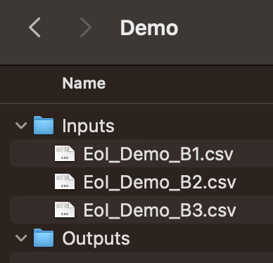

```{r setup, include=FALSE}
knitr::opts_chunk$set(
  echo = TRUE,       # Show the code in the html
  results = "hide", # Hide the results in the html
  message = FALSE,   # Hide messages in the HTML
  warning = FALSE    # Hide warnings in the HTML
)
```

# Step 1 - Define location of input files

This is the only code chunk you should have to change, when you process a new EoI batch!

It assumes you have a folder called 'Inputs' where all your (raw) EoI csv files are stored. In this same location, create an empty folder called 'Outputs'. For example:

{width="262"}

```{r}
# CHANGE NEXT LINE - the location storing 'Inputs' and 'Outputs'
cEoI_directory <- "~/Documents/GitHub/BridgeAI/EoIs" 
# CHANGE NEXT LINE - the file name of the EoI you want to process in this session
cEoI_csv_filename <- "EoI_Demo_B1.csv" 
```

# Step 2 - Read in the EoI input csv and create specific output directory

## 2a. Load in the current EoI (cEoI)

Running the code chunk below will load in the current EoI (the one you want to process)

```{r}
cEoI <- read.csv(paste0(cEoI_directory,'/Inputs/',cEoI_csv_filename), header = TRUE) # read the current EoI excel file into R
raw_cEoI <- cEoI # to save later, unedited
head(cEoI) # view the first few rows of the data
```

If you want to have a broader view of the data, go to your 'Environment tab' in RStudio and click on 'cEoI' - this will open up a new window for you to browse. Double check that the data has been read into R correctly i.e. correct size, not corrupted (numbers and dates read in as expected).

## 2b. Create output directory to store output files

```{r}
output_dir <- paste0(cEoI_directory,'/Outputs/OUTPUTS_',tools::file_path_sans_ext(basename(cEoI_csv_filename)))
if (!dir.exists(output_dir)) {
} else {
    warning(paste0('Output directory already exists for this EoI(',cEoI_csv_filename, ').Running the rest of the code may mean previously created files get overwritten.'))
  }
 
```

# Step 3 - Validation of cEoI

## 3a. Check that the csv structure matches the demo structure

We are assuming that the folder 'Demo_Inputs' is in the same location as this 1_EoI_Process.Rmd file, and contains the file 'EoI_Demo_B1.csv'.

```{r}
demo_EoI <- read.csv('Demo_Inputs/EoI_Demo_B1.csv', header = TRUE) # read the current EoI excel file into R
```

```{r}
# Check if the number of columns is the same
if (ncol(cEoI) != ncol(demo_EoI)) {
  warning("Comparing EoI to the demo EoI. \nNumber of columns does not match! Resolve before continuing.")
} else {
  # Check if the column names are the same
  if (all(names(cEoI) == names(demo_EoI))) {
    print("Comparing EoI to the demo EoI: The structure matches! Please continue.")
  } else {
    warning("Comparing EoI to the demo EoI. \nThe column names do not match! Resolve before continuing.")
  }
}
```

## 3b. No Consent

Find if any companies did not consent to their data being processed. If companies are found to have selected 'No', they will be put into a new dataframe 'cEoI_NoConsent', and the rest of the companies are put into 'cEoI_Val1', indicating they have passed validation step 1. You can click on these new data frames in your R environment to explore what they contain, or run the code `head(dataframe-name)` to view the first few rows.

```{r}
# Find the column indices for rows with partial name matches
consent_col_indices <- grep("Please.tick.to", colnames(cEoI))
# Identify the rows where any of the identified columns contain 'No' (partial match)
rows_with_no_consent_indices <- apply(cEoI[, consent_col_indices], 1, function(row) any(grepl("No", row)))
# Subset the dataframe to get the rows with 'No' consent
cEoI_NoConsent <- cEoI[rows_with_no_consent_indices, , drop = FALSE]
# Remove these rows from the original dataframe
cEoI_Val1 <- cEoI[!rows_with_no_consent_indices, , drop = FALSE] 
```

## 3c. Duplicates

Check if there are any duplicate companies across batches . The code chunk below compares the currently select EoI with any other EoIs it finds in the 'Inputs' directory. If duplicates are found they will be put into a new dataframe 'cEoI_Duplicates', and the rest of the companies are put into 'cEoI_Val12', indicating they have passed validation step 1 and 2.

```{r}
# Define the column names to check for duplicates on
column_names <- c('Organisation.Name', 'Companies.House.Registration.no.', 'Website', 'Email.address')

# List all files in the directory, excluding the reference csv (cEoI)
EoI_list <- list.files(paste0(cEoI_directory, '/Inputs'))
EoI_list <- EoI_list[EoI_list != cEoI_csv_filename]

# Initialize a list to store past dataframes
all_pEoI <- list()

# Read each past file and store the dataframes in a list
for (EoI_file in EoI_list) {
  print(paste0('Checking for duplicates in ',EoI_file))
  # Read in the past EoI file
  pEoI <- read.csv(paste0(cEoI_directory, '/Inputs/', EoI_file), header = TRUE)
  all_pEoI[[EoI_file]] <- pEoI
}

# Combine all past dataframes into one
combined_pEoI <- do.call(rbind, all_pEoI)

# Extract the specified columns as a subset df
subset_cEoI <- cEoI_Val1[, column_names, drop = FALSE]
subset_combined_pEoI <- combined_pEoI[, column_names, drop = FALSE]

# Identify the duplicated rows within cEoI_Val1
duplicated_within_cEoI <- apply(subset_cEoI, 2, function(col) duplicated(col) | duplicated(col, fromLast = TRUE))
duplicated_within_cEoI <- apply(duplicated_within_cEoI, 1, any)

# Identify the duplicated rows between cEoI_Val1 and combined_pEoI
duplicated_between_cEoI_pEoI <- apply(subset_cEoI, 1, function(row) any(apply(subset_combined_pEoI, 1, function(x) any(x == row))))

# Combine both conditions to find all duplicates in cEoI
all_duplicated_rows <- duplicated_within_cEoI | duplicated_between_cEoI_pEoI

# Find the row indices where cEoI has these duplicated values
matching_indices <- which(all_duplicated_rows)

# Create a new data frame with the matching rows
cEoI_Duplicates <- cEoI_Val1[matching_indices, , drop = FALSE]

# Remove the matching rows from the original cEoI dataframe
if (length(matching_indices) != 0) {
  cEoI_Val12 <- cEoI_Val1[!all_duplicated_rows, , drop = FALSE]
} else {
  cEoI_Val12 <- cEoI_Val1
}
```

## 3d. Validate the validations!

We now have 3 dataframes (cEoI_Val12, cEoI_NoConsent and cEoI_Duplicates). The number of rows (companies) in these dataframes should add up to the same number in the original dataframe (cEoI) before we did anything to it. Let's check that, to make sure we have not lost or added a company.

```{r}

# Calculate the number of rows across the 3 dataframes
total_rows_split <- nrow(cEoI_Val12) + nrow(cEoI_NoConsent) + nrow(cEoI_Duplicates)

# Calculate the number of rows in the original dataframe
rows_cEoI <- nrow(cEoI)

# Compare the sum to the number of rows in the original dataframe
if (total_rows_split == rows_cEoI) {
  cat("Great! The number of rows in the split dataframes adds up to the number of rows in the original dataframe.\n")
} else {
  warning("Oh no! The number of rows in the split dataframes does NOT add up to the number of rows in the original dataframe.\n")
}
```

Take a look at the validated data frame:

```{r}
head(cEoI_Val12)
```

# Step 4 - Tidy up Current_EoI

Running the code chunk below will rename columns to be more sensible to read.

-   4a. Replace '.' with a space (works better for some row names than others)

-   4b. Rename some specific columns (feel free to change this!)

-   4c. Add in new columns, that will be filled in later (feel free to change this!)

-   4d. Remove some columns that will be less relevant when pairing with ISAs (feel free to change this!)

```{r}

# Create a list of the 3 dataframes we've created 
dataframes_list <- list(cEoI_Val12, cEoI_Duplicates, cEoI_NoConsent)

for (i in seq_along(dataframes_list)) {
  cEoI_df <- dataframes_list[[i]]
  
  # 4a - Replace '.' with a space 
  colnames(cEoI_df) <- gsub("\\.\\.", ",", colnames(cEoI_df)) 
  colnames(cEoI_df) <- gsub("\\.", " ", colnames(cEoI_df)) 

  # 4b - Rename some specific columns
  colnames(cEoI_df)[colnames(cEoI_df) == "Please choose which option best describes what sort of company or organisation is seeking support "] <- "Organisation Stage"
  colnames(cEoI_df)[colnames(cEoI_df) == "Agriculture and food processing"] <- "SECTOR: Agriculture & food processing"
  colnames(cEoI_df)[colnames(cEoI_df) == "Construction"] <- "SECTOR: Construction"
  colnames(cEoI_df)[colnames(cEoI_df) == "Creative Industries"] <- "SECTOR: Creative Industries"
  colnames(cEoI_df)[colnames(cEoI_df) == "Software technology development,AI ML "] <- "SECTOR: Software technology development (AI/ML)"
  colnames(cEoI_df)[colnames(cEoI_df) == "Transportation,including logistics and warehousing"] <- "SECTOR: Transportation, including logistics & warehousing"
  colnames(cEoI_df)[colnames(cEoI_df) == "Other,1 "] <- "SECTOR: Other"
  colnames(cEoI_df)[colnames(cEoI_df) == "Company culture,approach to innovation"] <- "BARRIER: Company culture, approach to innovation"
  colnames(cEoI_df)[colnames(cEoI_df) == "Data quality,data sharing and or data management issues"] <- "BARRIER: Data quality, sharing and/or management"
  colnames(cEoI_df)[colnames(cEoI_df) == "Costs and complexity"] <- "BARRIER: Costs & complexity"
  colnames(cEoI_df)[colnames(cEoI_df) == "Lack of strategy and clear objectives"] <- "BARRIER: Lack of strategy and clear objectives"
  colnames(cEoI_df)[colnames(cEoI_df) == "Ethical,regulatory and compliance"] <- "BARRIER: Ethical, regulatory & compliance"
  colnames(cEoI_df)[colnames(cEoI_df) == "Process deficiencies and storage"] <- "BARRIER: Process deficiencies & storage"
  colnames(cEoI_df)[colnames(cEoI_df) == "Other,2 "] <- "BARRIER: Other"
  colnames(cEoI_df)[colnames(cEoI_df) == "Data scientists"] <- "CURRENT: Data scientists"
  colnames(cEoI_df)[colnames(cEoI_df) == "Machine learning experts"] <- "CURRENT: Machine learning experts"
  colnames(cEoI_df)[colnames(cEoI_df) == "Software engineers"] <- "CURRENT: Software engineers"
  colnames(cEoI_df)[colnames(cEoI_df) == "Data engineers"] <- "CURRENT: Data engineers"
  colnames(cEoI_df)[colnames(cEoI_df) == "Data analysts"] <- "CURRENT: Data analysts"
  colnames(cEoI_df)[colnames(cEoI_df) == "Statisticians"] <- "CURRENT: Statisticians"
  
  # 4c - add in some new (empty) columns 
  new_column_names <- c('Fit to BridgeAI - Y/N/Maybe',
                   'Fit to Turing offerings - Y/N/Maybe',
                   'Suitability - ISA - Y/N/Maybe',
                   'Rationale',
                   'Suggested way forward',
                   'Notes',
                   'Partnerships contact (to provide 2nd opinion / further qualification)',
                   'Additional notes',
                   'Category',
                   'Mapping to ISA Lead (initial)')
  
  # 4c - add new columns to the data frame
  for (column_name in new_column_names) {
    if (nrow(cEoI_df) == 0) {
      cEoI_df[[column_name]] <- character()  # Initialize with an empty character vector
    } else {
      cEoI_df[[column_name]] <- 'TO FILL'  # Initialize with the default value
    }
  }
  
  # 4d - remove some columns from the data frame
  cols_to_remove <- c("ID", "Date","IP Address","URL","User Agent")
  cols_to_remove_combined <- c(which(names(cEoI_df) %in% cols_to_remove), consent_col_indices)
  cEoI_df <- cEoI_df[, -cols_to_remove_combined]

  # Update the dataframe in the list, with the above changes
  dataframes_list[[i]] <- cEoI_df
}

# Extract the modified dataframes back to their original variables
cEoI_Val12 <- dataframes_list[[1]]
cEoI_Duplicates <- dataframes_list[[2]]
cEoI_NoConsent <- dataframes_list[[3]]
```

Explore the result of each tidy data frame:

```{r}
head(cEoI_Val12)
```

# Step 5 - Restructure the validated cEoI and save to excel

Now we will restructure the dataframe(s) in a way that is helpful for the next steps of matching each company to an ISA. We will then save each dataframe as a separate tab of an excel output.

```{r}

# Load specific library needed for this code chunk
library(openxlsx)

# Transpose the dataframe (this means turn columns into rows)
cEoI_T <- as.data.frame(t(raw_cEoI))
colnames(cEoI_T) <- NULL
cEoI_Val12_T <- as.data.frame(t(cEoI_Val12))
cEoI_NoConsent_T <- as.data.frame(t(cEoI_NoConsent))
cEoI_Duplicates_T <- as.data.frame(t(cEoI_Duplicates))

# Create a new workbook
wb <- createWorkbook()

# Define a list of worksheet names and corresponding data frames
worksheets <- list(
  "Raw" = cEoI_T,
  "Validated" = cEoI_Val12_T,
  "NoConsent" = cEoI_NoConsent_T,
  "Duplicates" = cEoI_Duplicates_T
)

# Create a bold text & shaded style
BorderStyle <- createStyle(
  fgFill = "#F0F0F0", 
  wrapText = TRUE, 
  border = "TopBottomLeftRight",
  halign = "left"
)

NonBorderStyle <- createStyle(
  halign = "left"
)

# Add worksheets, write dataframes to them, and apply styles
for (sheet_name in names(worksheets)) {
  data <- worksheets[[sheet_name]]
  
  # Add worksheet
  addWorksheet(wb, sheet_name)
  
  # Write data to worksheet
  writeData(wb, sheet_name, data, rowNames = TRUE)
  
  # Apply BorderStyle style to the first row
  addStyle(wb, sheet_name, style = BorderStyle, rows = 1, cols = 1:ncol(data) + 1, gridExpand = TRUE)
  # Apply BorderStyle to the first column
  addStyle(wb, sheet_name, style = BorderStyle, rows = 1:(nrow(data) + 1), cols = 1, gridExpand = TRUE)
  # Set non-BorderStyle to all other rows and columns
  addStyle(wb, sheet_name, style = NonBorderStyle, rows = 2:nrow(data) + 1, cols = 2:ncol(data) + 1, gridExpand = TRUE)
  # Set the width of the first column
  setColWidths(wb, sheet_name, cols = 1, widths = 30)  # Adjust the width as needed
}

# Save the workbook
in_filename <- tools::file_path_sans_ext(basename(cEoI_csv_filename)) # Extract the file name without extension
out_filename <- file.path(paste0(in_filename, "_formatted.xlsx")) # Construct the output file path with the new extension
saveWorkbook(wb, paste0(output_dir,'/',out_filename), overwrite = TRUE)

```
