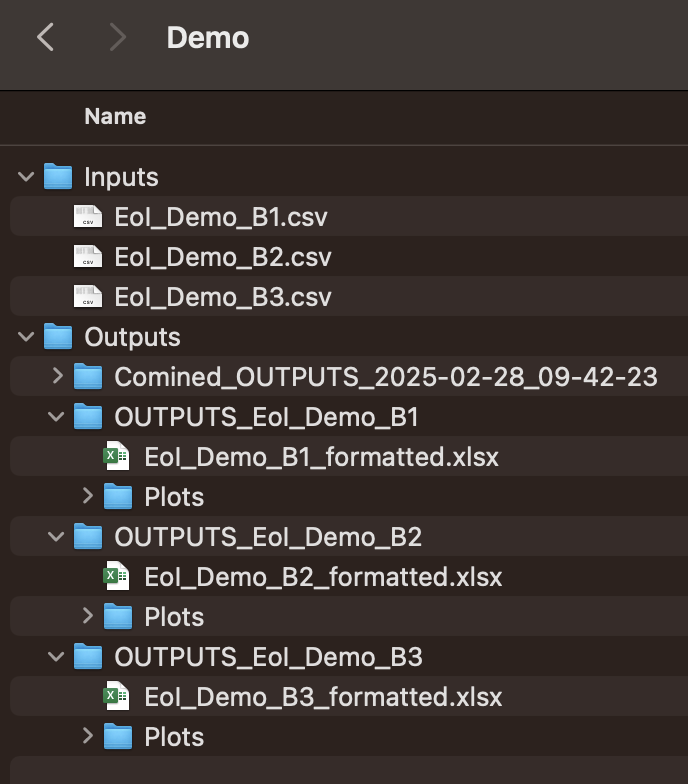

# Automating the processing of EoI files

## Introduction

The purpose of this work is to automate some manual data wrangling and validation steps that are often done when a new batch of EoIs are received. Another purpose is to create summary plots about companies submitting these EoIs, to aid presentation and reports.

More specifically, [2_EoI_Process.Rmd](2_EoI_Process.Rmd) reads in a `EoI_BatchX_raw.csv` and outputs a `EoI_BatchX_formatted.xlsx.`
- The output excel file is tidied and restructured in such a way to aid the next stage of processing for the program management team (pairing companies with ISAs). 
- The output excel file has passed validation checks (1) Checking if a company has consented to data sharing, and (2) Searching for duplicate information which suggests a company has submitted an EoI more than once. It searches for duplications within the current EoI batch, but also across previous EoI batches.

Then [3_EoI_Plot.Rmd](3_EoI_Plot.Rmd) creates bar plots for each EoI batch separately and all batches together, to summarise and visualise features of the companies. Every time you run this plotting code, it will update the group plots that represent all EoI batches so far. 

## People working on this
- Rachael Stickland (BridgeAI ISA and Turing employee)
- Alexandra Araujo Alvarez (BridgeAI Senior Research Community Manager)
- Punita Maisuria 
- *Please add*

## Running the R code

 Prerequisites:

 - Install `R` and `R Studio` on your computer (to interact with `R`)
 - Access to raw EoI csv files  

Running the code:

- Locally, download the files within this folder to your computer (or a better option - clone this GitHub repository).
- The first time you run the code, read and run [1_EoI_SetUp.Rmd](1_EoI_SetUp.Rmd)
- Every time you have a new EoI batch, run [2_EoI_Process.Rmd](2_EoI_Process.Rmd) and [3_EoI_Plot.Rmd](3_EoI_Plot.Rmd)
- When you open up the R notebook files, select Visual mode: 

At the start of your session your file structure may look like this:

After processing batches 1-3 it will something like this:

Understanding each tab in the formatted output file:
1. The Raw tab contains unprocessed data - the same as the csv file, just transposed (columns are now rows).
2. The Validated tab contains companies passing the two validation steps (in this example: 2,3,5,6,7,8,9)
3. The NoConsent tab contains companies that did not click Yes to data sharing (in this example: 4)
4. The Duplicates tab contains companies that had a match with another company, based on organisation name, companies house registration no, website, or email address (in this example: 1 and 9). After the column number the text indicates which EoI file found a match, for example for company 1 there was a match found in EoI_Demo_B2. After checking the duplicate further, you could choose to move them back to the 'Validated' tab if you want them to be included in the pairing with ISAs. 

## :warning: Important note about personal data 

No data should be stored on this GitHub repo! Just the code to process the data. `R notebook` files can contain outputs from running the code chunks. Clear all outputs before uploading/pushing a new version to GitHub to make sure only the code (not the output of the code) is displayed. Make sure no outputs are present in the `.Rmd` file or any rendered files ( `.html` or `PDF`). 

The data contained in [Demo_Inputs](Demo_Inputs) is made up data, generated pseudo-randomly, to match the structure of real data files. Any resemblance to real people or companies is purely coincidental and unintended. This data is intended solely for testing and development purposes and should not be used in any real-world applications or scenarios.

## New features to consider implementing
- Think about other filters that may make a company not eligible for ISA support (e.g. employees > 250, not in UK) and include these in the validation steps
- When checking for duplicates, consider doing partial name matches
- Improvements to plots and summary statistics
- Cutting down lines of code (make more efficient, some currently a bit long winded)
- Can we pre-match companies to ISAs in some sort automated way to begin with - based on key words matches - can AI help? 

